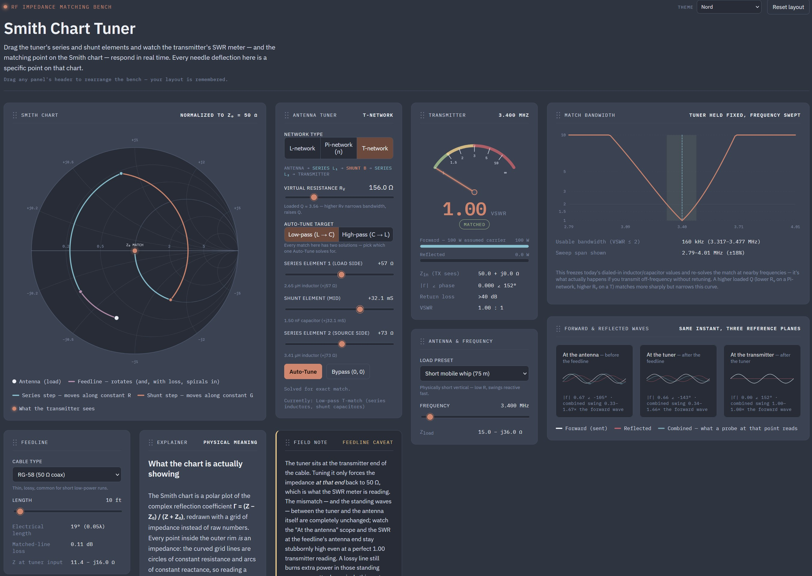

# Smith Chart Tuner

An interactive, single-page simulation of an antenna tuner: drag the series
and shunt elements of an **L-network**, **Pi-network (π)**, or
  **T-network** (or hit Auto-Tune) and watch the effect
ripple through an analog SWR meter, a live Smith chart, and a pair of
forward/reflected waveform scopes — all driven by the same underlying
transmission-line math, not canned animations.

Open `index.html` in any modern browser. There is nothing to build or
install; the whole tool is one static HTML file.

## LIVE demo

[Smith Chart Tuner](https://jurgenkobierczynski.com/SmithChartTuner/index.html)

## Screenshots



## Made with Claude

Made using Claude Sonnet 5 High

## What it shows

- **SWR meter** — an analog cross-needle-style gauge reading VSWR from the
  reflection coefficient at the transmitter, with forward/reflected power
  bars (100 W assumed carrier).
- **Antenna & frequency** — a few illustrative antenna presets (a resonant
  dipole, a short mobile whip, an end-fed long wire, and a flat 50 Ω
  reference load) whose feedpoint impedance shifts with frequency using a
  simplified resonance model.
- **Feedline** — insert a length of transmission line between the antenna
  and the tuner: pick a cable (ideal lossless 50 Ω, RG-58, RG-213, LMR-400,
  or 450 Ω ladder line) and a length, and watch the impedance the tuner
  actually sees rotate around the Smith chart as the line's electrical
  length changes, spiraling slowly inward if the cable has loss. A line
  whose own characteristic impedance differs from the chart's 50 Ω
  normalization (like ladder line) traces an off-center loop rather than a
  simple circle — this is real transmission-line math (exact complex
  reflection-coefficient rotation and decay), not a canned animation, so it
  correctly reproduces that effect. Readouts show the electrical length (in
  degrees and wavelengths), the matched-line loss in dB, and the resulting
  impedance at the tuner's input.
- **Antenna tuner** — choose an **L-network**, **Pi-network (π)**, or
  **T-network** topology. The L-network offers two tuning controls, a
  series reactance and a shunt susceptance, in either signal-path order
  (series-then-shunt or shunt-then-series); the Pi- and T-networks add a
  third element and a **virtual resistance R<sub>v</sub>** control that
  sets the loaded Q where their two constituent L-sections meet — the
  extra degree of freedom a three-element network has that a plain
  L-match doesn't. Every match is labeled with the equivalent inductor or
  capacitor value at the current frequency. An **Auto-Tune** button solves
  the exact match analytically for whichever topology is selected
  (flipping the L-network's signal-path order on its own if the one
  you've selected has no solution for the current load). Every match has
  two valid root solutions, so an **Auto-Tune target** toggle lets you
  choose which one to solve for — low-pass (series inductor, shunt
  capacitor) or high-pass (series capacitor, shunt inductor) — and a live
  label classifies whatever combination is currently dialed in, including
  by hand, as low-pass, high-pass, bypassed, or a mixed combination that
  isn't a canonical match at all.
- **Color themes** — a theme picker in the header switches the whole page
  between the default dark instrument look, Solarized Dark, Solarized
  Light, Nord, and Dracula; your choice is remembered locally.
- **Smith chart** — a normalized (Z₀ = 50 Ω) impedance chart with true
  circular grid geometry. It plots the antenna's raw reflection
  coefficient, the feedline's rotation (and, with loss, inward spiral), the
  trajectory each tuning element sweeps (series moves along a
  constant-resistance circle, shunt moves along a constant-conductance
  circle), and the impedance the transmitter actually sees.
- **Match bandwidth** — a VSWR-vs-frequency sweep around the currently
  tuned frequency, with today's dialed-in series/shunt elements frozen as
  real inductor and capacitor values (not fixed ohms) and re-solved at each
  nearby frequency — showing what actually happens if you transmit
  off-frequency without retuning. It reports the usable bandwidth (VSWR ≤
  2) and makes the loaded-Q trade-off on the Pi- and T-networks' R<sub>v</sub>
  control tangible: a sharper match (lower R<sub>v</sub> on a Pi-network,
  higher R<sub>v</sub> on a T) narrows this curve, a gentler one widens it.
- **Forward & reflected waves** — three oscilloscope-style panels comparing
  the sent and reflected sine waves, with their real amplitude ratio and
  phase, at the antenna (before the feedline), at the tuner (after the
  feedline), and at the transmitter (after the tuner) — making it visible
  that the tuner only fixes what the transmitter sees, not the standing
  waves on the feedline or at the antenna itself.
- **Movable, masonry-packed layout** — a wide dashboard grid (up to six
  columns on a large enough or zoomed-out window) where every panel can be
  dragged by its header into any order. Panels pack like masonry: a short
  panel tucks into whatever space a taller neighbor leaves free in its
  column instead of every panel in a row being forced to the height of the
  tallest one. The arrangement is remembered locally (via `localStorage`),
  and a "Reset layout" button restores the default.

## How it works

Everything is derived from a handful of closed-form transmission-line
relationships, computed live in plain JavaScript:

- Reflection coefficient: Γ = (Z − Z₀) / (Z + Z₀)
- VSWR: (1 + |Γ|) / (1 − |Γ|)
- The Smith chart grid (constant-resistance circles, constant-reactance
  arcs) is drawn from its exact center/radius in the Γ-plane, not
  approximated, so it stays perfectly round at any zoom level.
- The feedline is modeled with the exact lossy transmission-line equation
  Γ_in = Γ_L · e^(−2γl), γ = α + jβ, using genuine complex-number
  arithmetic — so a line's own characteristic impedance (like 450 Ω ladder
  line) can differ from the chart's 50 Ω reference, correctly producing an
  off-center Möbius-transformed loop rather than a simple circle. Coax
  loss is scaled with frequency roughly as √f, matching real skin-effect
  behavior at HF.
- The match-bandwidth sweep takes the currently dialed series/shunt values,
  converts them to an equivalent inductance or capacitance at the center
  frequency, and re-derives each element's reactance or susceptance at
  every swept frequency before re-solving the network — so the curve
  reflects how a real fixed-value inductor or capacitor actually behaves
  off-frequency, not just a fixed-ohms approximation.
- The L-network auto-tune solver matches a complex load to a real target
  resistance analytically (the standard "Q-based" L-match formulas),
  rather than searching numerically. The Pi- and T-network solvers reuse
  that same L-match solver twice, matching the load down (Pi) or up (T)
  to a real virtual resistance and back to Z₀ — the classic way a
  three-element network decomposes into two L-sections.

Feedpoint impedances for the antenna presets are simplified, illustrative
curves for teaching purposes — not measured antenna data. Cable loss
figures are similarly illustrative, not a manufacturer's spec.

## Files

```
index.html   the entire application (HTML, CSS, and JavaScript — no build step)
LICENSE      GNU General Public License v3.0
README.md    this file
```

## Requirements

Any reasonably current desktop or mobile browser. An internet connection
is used only to load the IBM Plex Sans/Mono webfonts from Google Fonts;
without it the page still works fine and falls back to your system fonts.

## License

Licensed under the GNU General Public License v3.0 — see [LICENSE](LICENSE)
for the full text. In short: you're free to use, study, modify, and
redistribute this software, including commercially, as long as derivative
works are also distributed under the GPL-3.0 with source available.
